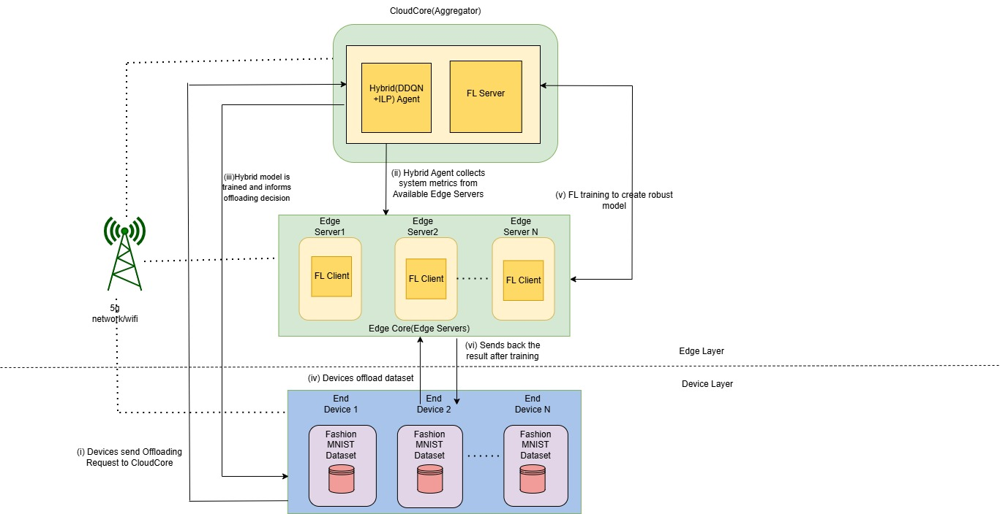

# Hybrid DDQN-ILP Framework for Intelligent Offloading with Federated Edge Computing

<p align="center">
  
</p>

<p align="center">
  <b>A 3-tier Cloud–Edge–Device architecture for intelligent task offloading using Hybrid DDQN+ILP with Federated Learning over gRPC</b>
</p>

<p align="center">
  
  
  
  
  
</p>

---

## 📋 Table of Contents

- [Overview](#overview)
- [System Architecture](#system-architecture)
- [Key Algorithms](#key-algorithms)
- [Project Structure](#project-structure)
- [Prerequisites](#prerequisites)
- [Installation](#installation)
- [Network Configuration](#network-configuration)
- [Running the System](#running-the-system)
- [gRPC Protocol](#grpc-protocol)
- [Mathematical Model](#mathematical-model)
- [Team](#team)

---

## 🔍 Overview

This project implements a **Hybrid Double Deep Q-Network (DDQN) + Integer Linear Programming (ILP)** framework for intelligent task offloading in a **Federated Edge Computing** environment. The system leverages **5G/Wi-Fi** connectivity to enable distributed machine learning across a 3-tier architecture: **Cloud**, **Edge**, and **Device**.

### Key Features

- **Hybrid DDQN+ILP Edge Selection** — Combines reinforcement learning exploration with optimal ILP-based edge assignment
- **Federated Learning (FedAvg)** — Privacy-preserving distributed training on Fashion-MNIST across edge nodes
- **Real-time Edge Monitoring** — Live system metrics (CPU, memory, bandwidth, latency) via `psutil`
- **Dynamic Stress Testing** — Simulates varying network conditions using `stress-ng` on edge VMs
- **gRPC Communication** — High-performance RPC framework for inter-node communication
- **Non-IID Data Distribution** — Each device specializes in 2-3 Fashion-MNIST classes for realistic FL scenarios
- **Warm-up Strategy** — ILP-only phase for first 5 rounds, then hybrid DDQN+ILP decision making

---

## 🏗️ System Architecture

The system follows a **3-tier architecture** deployed on VMware virtual machines:

| Tier | Role | Description |
|------|------|-------------|
| ☁️ **Cloud (Aggregator)** | Central coordinator | Runs DDQN+ILP agent, manages FL rounds, performs FedAvg aggregation |
| 🖥️ **Edge Servers** | Local trainers | Receive data from devices, train CNN locally (3 epochs), report metrics to cloud |
| 📱 **Devices** | Data sources | Hold Fashion-MNIST data (non-IID), offload subsets to assigned edge nodes |

### Communication Flow

```
1. Devices → Cloud:     Register & signal readiness (gRPC)
2. Cloud → Edges:       Collect real-time metrics (CPU, MEM, BW, Latency)
3. Cloud (DDQN+ILP):    Select optimal edge for each device
4. Devices → Edge:      Offload Fashion-MNIST data subset
5. Edge:                Train CNN locally (3 epochs, FedAvg)
6. Edge → Cloud:        Send trained model weights back
7. Cloud:               Aggregate via Federated Averaging
8. Cloud → Devices:     Distribute updated global model
```

---

## 🧠 Key Algorithms

### Double Deep Q-Network (DDQN)

- **State**: Per-edge metrics (CPU, Memory, Bandwidth, Latency, Stress, Availability) → `STATE_SIZE = NUM_EDGES × 6`
- **Action**: Select one of `NUM_EDGES` edge servers
- **Network**: 4-layer FC (256 → 128 → 64 → action_size)
- **ε-greedy**: Starts at 1.0, decays by 0.995 per round, minimum 0.1
- **Warm-up**: First 5 rounds use ILP-only (exploration without DDQN)

### Integer Linear Programming (ILP)

Minimizes the cost function:

$$Z_t = \sum_{j=1}^{M} \left( \lambda_1 \tilde{T}_{t,j} + \lambda_2 \tilde{E}_{t,j} + \lambda_3 \overline{CPU}_{t,j} \right) \cdot x_{t,j}$$

Where:
- $\lambda_1 = 0.4$ (Latency weight), $\lambda_2 = 0.3$ (Stress/Energy weight), $\lambda_3 = 0.3$ (CPU weight)
- Subject to CPU, Memory, and Bandwidth feasibility constraints

### Hybrid Decision Logic

| Condition | Decision |
|-----------|----------|
| Rounds 1–5 (Warm-up) | ILP only |
| DDQN and ILP agree | Consensus selection |
| ILP cost is >10% better | Use ILP |
| DDQN Q-value > 0.5 | Use DDQN |
| Both disagree, low confidence | Conservative ILP fallback |

### Federated Averaging (FedAvg)

$$w_{t+1} = \sum_{k=1}^{K} \frac{n_k}{n} w_k^{t}$$

Where $n_k$ is the number of samples trained on edge $k$ and $n$ is total samples.

---

## 📁 Project Structure

```
├── cloud/
│   ├── cloud.py                       # Cloud server (DDQN+ILP agent, FL aggregator)
│   ├── models.py                      # FashionMNISTCNN model definition
│   ├── federated_learning.proto       # gRPC protocol definition
│   ├── federated_learning_pb2.py      # Generated protobuf classes
│   └── federated_learning_pb2_grpc.py # Generated gRPC stubs
│
├── edge/
│   ├── edge.py                        # Edge node service (local training, metrics)
│   ├── models.py                      # FashionMNISTCNN model definition
│   ├── federated_learning.proto       # gRPC protocol definition
│   ├── federated_learning_pb2.py      # Generated protobuf classes
│   └── federated_learning_pb2_grpc.py # Generated gRPC stubs
│
├── device/
│   ├── device.py                      # Device FL client (Fashion-MNIST data loader)
│   ├── models.py                      # FashionMNISTCNN model definition
│   ├── federated_learning.proto       # gRPC protocol definition
│   ├── federated_learning_pb2.py      # Generated protobuf classes
│   └── federated_learning_pb2_grpc.py # Generated gRPC stubs
│
├── proto/
│   └── federated_learning.proto       # Master gRPC protocol definition
│
├── docs/
│   └── system_model.jpeg              # System architecture diagram
│
├── requirements.txt                   # Python dependencies
├── .gitignore                         # Git ignore rules
└── README.md                          # This file
```

> **Note:** Each tier (cloud/edge/device) contains its own copy of the proto files and generated stubs. This is by design — each tier is deployed on a **separate VM** and needs local access to the gRPC definitions.

---

## ⚙️ Prerequisites

- **Python** 3.8 or higher
- **VMware** environment with multiple VMs (Cloud VM, Edge VMs, Device VMs)
- **Network connectivity** between all VMs (5G/Wi-Fi)
- **stress-ng** installed on Edge VMs (for stress testing)
- **Ports**: 5000 (Cloud), 5001 (Edge nodes)

---

## 📦 Installation

### 1. Clone the repository (on all VMs)

```bash
git clone https://github.com/vindheg/Hybrid-DDQN-ILP-Federated-Edge-Computing.git
cd Hybrid-DDQN-ILP-Federated-Edge-Computing
```

### 2. Install Python dependencies (on all VMs)

```bash
pip install -r requirements.txt
```

### 3. Install stress-ng (on Edge VMs only — Linux)

```bash
sudo apt-get install stress-ng
```

### 4. Regenerate gRPC stubs (optional — only if you modify the proto file)

```bash
python -m grpc_tools.protoc -I. --python_out=. --grpc_python_out=. federated_learning.proto
```

---

## 🌐 Network Configuration

Before running, update the IP addresses in each component to match your network:

### Cloud VM (`cloud/cloud.py`)

```python
EXTERNAL_IP = '<CLOUD_VM_IP>'      # Your Cloud VM's IP (e.g., '192.168.61.63')

EDGE_CONFIGS = [
    {'internal_ip': '<EDGE_VM_1_IP>', ...},
    {'internal_ip': '<EDGE_VM_2_IP>', ...},
    # Add entries for each edge VM
]
```

### Edge VMs (`edge/edge.py`)

```python
CLOUD_IP = '<CLOUD_VM_IP>'         # Must match cloud's EXTERNAL_IP
EDGE_SPECS = [
    {'ip': '<EDGE_VM_1_IP>', ...},
    {'ip': '<EDGE_VM_2_IP>', ...},
    # Match your edge VM IPs
]
```

### Device VMs (`device/device.py`)

```python
CLOUD_IP = '<CLOUD_VM_IP>'         # Must match cloud's EXTERNAL_IP
```

### Firewall Rules

Ensure these ports are open on all VMs:

| Port | Service | Direction |
|------|---------|-----------|
| 5000 | Cloud gRPC server | Inbound on Cloud VM |
| 5001 | Edge gRPC server | Inbound on Edge VMs |

```bash
# Linux example
sudo ufw allow 5000/tcp
sudo ufw allow 5001/tcp
```

---

## 🚀 Running the System

> **Important:** Start the components in this order: **Cloud → Edge(s) → Device(s)**

### Step 1: Start the Cloud Server

On the **Cloud VM**, navigate to the `cloud/` directory:

```bash
cd cloud/
python cloud.py
```

**Expected output:**
```
☁️ CLOUD CORE SERVICE INITIALIZED
  Cloud IP: <CLOUD_VM_IP>:5000
  Edge VMs: <N>
  DDQN+ILP: Enabled
  Warmup Rounds: 5

🚀 CLOUD CORE STARTED
  Hybrid Algorithm: DDQN+ILP (Warmup=5 rounds)
  Lambda Weights: λ₁=0.4, λ₂=0.3, λ₃=0.3
```

### Step 2: Start Edge Node(s)

On each **Edge VM**, navigate to the `edge/` directory:

```bash
cd edge/
python edge.py <EDGE_ID>
```

Where `<EDGE_ID>` is the index (0, 1, 2, ...) matching the order in `EDGE_SPECS`.

**Examples:**
```bash
# Edge VM 1
python edge.py 0

# Edge VM 2
python edge.py 1

# Edge VM 3
python edge.py 2
```

**Expected output:**
```
🖥️ EDGE NODE 0 - READY
  📍 IP Address: <EDGE_IP>:5001
  ☁️  Cloud Server: <CLOUD_IP>:5000
  🤖 ML Model: Fashion-MNIST CNN (compatible with Cloud)
  📊 Metrics: Auto-reporting to Cloud every 5s
```

### Step 3: Start Device Client(s)

On each **Device VM**, navigate to the `device/` directory:

```bash
cd device/
python device.py <DEVICE_ID>
```

Where `<DEVICE_ID>` is a unique device identifier (1, 2, 3, ...).

**Examples:**
```bash
# Device 1
python device.py 1

# Device 2
python device.py 2

# Device 3
python device.py 3
```

**Expected output:**
```
📱 Device 1 - REAL Fashion-MNIST Federated Learning
📦 Device 1: Loading REAL Fashion-MNIST dataset...
✅ Device 1: Dataset loaded - 60000 train, 10000 test samples
📊 Device 1: Specializing in classes: [3, 4, 5]
  Class names: ['Dress', 'Coat', 'Sandal']
```

The device will automatically:
1. Download Fashion-MNIST (first run only)
2. Create a non-IID data split
3. Register with the Cloud
4. Participate in 50 rounds of federated learning

---

## 📡 gRPC Protocol

The system uses two gRPC services defined in `federated_learning.proto`:

### CloudCore Service (Port 5000)

| RPC Method | Request | Response | Description |
|------------|---------|----------|-------------|
| `RegisterDevice` | `DeviceInfo` | `RegistrationResponse` | Device registers with cloud |
| `ReadyForRound` | `ReadyRequest` | `ReadyResponse` | Device signals readiness |
| `GetAssignment` | `AssignmentRequest` | `AssignmentResponse` | Get edge assignment (triggers DDQN+ILP) |
| `GetGlobalModel` | `ModelRequest` | `ModelResponse` | Download global model weights |
| `ReportMetrics` | `EdgeMetricsReport` | `MetricsAck` | Edge reports system metrics |

### EdgeNode Service (Port 5001)

| RPC Method | Request | Response | Description |
|------------|---------|----------|-------------|
| `GetMetrics` | `MetricsRequest` | `MetricsResponse` | Cloud queries edge metrics |
| `ApplyStress` | `StressRequest` | `StressResponse` | Cloud applies stress levels |
| `ReceiveData` | `DataPayload` | `DataResponse` | Device offloads Fashion-MNIST data |
| `StartTraining` | `TrainingRequest` | `TrainingResponse` | Cloud triggers local FL training |
| `GetTrainingResults` | `ResultsRequest` | `ResultsResponse` | Cloud collects trained weights |
| `GetTrainingLogs` | `LogsRequest` | `LogsResponse` | Cloud fetches detailed training logs |

---

## 📐 Mathematical Model

### State Space

$$S_t = \left[ \tilde{CPU}_{t,1}, \tilde{MEM}_{t,1}, \tilde{BW}_{t,1}, \tilde{T}_{t,1}, \tilde{E}_{t,1}, A_{t,1}, \ldots \right] \in \mathbb{R}^{M \times 6}$$

### ILP Objective Function

$$\min_{x} Z_t = \sum_{j=1}^{M} \left( \lambda_1 \tilde{T}_{t,j} + \lambda_2 \tilde{E}_{t,j} + \lambda_3 \overline{CPU}_{t,j} \right) \cdot x_{t,j}$$

Subject to:
- $CPU_{t,j} + CPU_{task} \leq 0.9 \cdot CPU_{max,j}$
- $MEM_{t,j} + MEM_{task} \leq 0.9 \cdot MEM_{max,j}$
- $BW_{t,j} \leq 0.8 \cdot BW_{max,j}$
- $x_{t,j} \in \{0, 1\}$, $\sum_j x_{t,j} = 1$

### DDQN Update Rule

$$Y_t = R_t + \gamma \cdot Q'\left(S_{t+1}, \arg\max_a Q(S_{t+1}, a; \Theta); \Theta'\right)$$

### Reward Function

$$R_t = -\left(\lambda_1 \cdot Latency_t + \lambda_2 \cdot Stress_t + \lambda_3 \cdot CPU_t\right) + Accuracy_{bonus} + Time_{bonus}$$

---

## 🔧 Configuration Parameters

| Parameter | Default | Description |
|-----------|---------|-------------|
| `ROUNDS` | 50 | Total federated learning rounds |
| `WARMUP_ROUNDS` | 5 | ILP-only rounds before hybrid mode |
| `BATCH_SIZE` | 32 | DDQN replay buffer batch size |
| `GAMMA` | 0.95 | DDQN discount factor |
| `EPSILON_START` | 1.0 | Initial exploration rate |
| `EPSILON_MIN` | 0.1 | Minimum exploration rate |
| `EPSILON_DECAY` | 0.995 | Exploration decay rate |
| `LEARNING_RATE` | 0.001 | DDQN optimizer learning rate |
| `TARGET_UPDATE` | 5 | Target network update frequency |
| `LAMBDA` | [0.4, 0.3, 0.3] | ILP cost weights [Latency, Stress, CPU] |
| `SUBSET_SIZE` | 100 | Fashion-MNIST samples sent per round |
| `NUM_DEVICES` | 3 | Number of device clients |

---

## 🧪 Fashion-MNIST CNN Architecture

The shared CNN model used across all tiers:

```
FashionMNISTCNN(
  Conv2d(1, 32, kernel_size=3, padding=1) → ReLU → MaxPool2d(2)
  Conv2d(32, 64, kernel_size=3, padding=1) → ReLU → MaxPool2d(2)
  Dropout2d(0.25)
  Flatten → Linear(3136, 256) → ReLU → Dropout(0.5)
  Linear(256, 128) → ReLU
  Linear(128, 10)
)

Total Parameters: ~856,074
```

---

---

## 📄 License

This project is part of an academic research initiative. See [LICENSE](LICENSE) for details.
